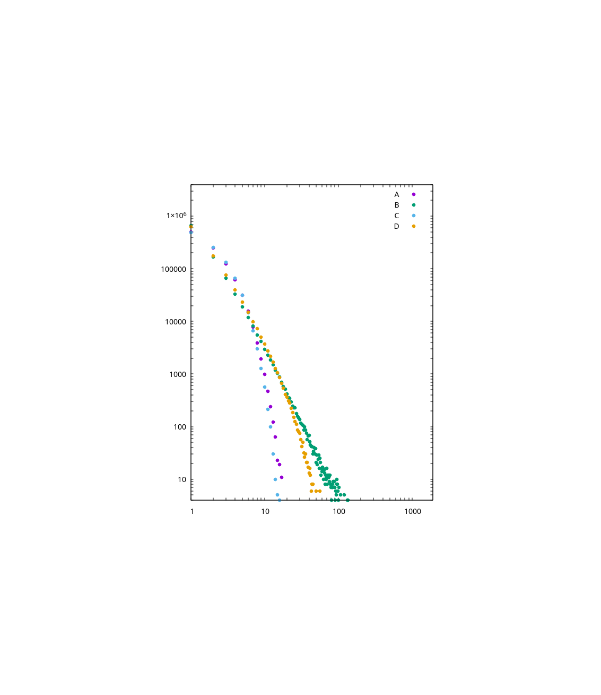

# goblins

_A model of goblins economy that produces a power law distribution. In Rust._

## Overview

This repo is just a small playground that was mainly inspired by a talk with my friend [konstantin-ogulchansky](https://github.com/konstantin-ogulchansky) about his [thesis](https://github.com/konstantin-ogulchansky/hypergraphs). The thesis is about hypergraphs where I barely understand any word, but what clicked me for a moment was the idea of [power law](https://en.wikipedia.org/wiki/Power_law) (you probably heard about [Pareto principle](https://en.wikipedia.org/wiki/Pareto_principle)). So I decided to create a very simple model that would be able to produce something that also follows a power law distribution.

## Model

The basic metaphor of the model is the goblins economy. Rules are simple:
- each goblin has some gold
- each simulation step:
  * a _random alive_ goblin receives gold (_lucky_ one)
  * a new goblin is born
  * a _random alive_ goblin dies (_unlucky_ one)

What makes this model interesting is how both lucky and unlucky goblins are chosen. Consider the following strategies:
- chances are _equal_ between all goblins ([Discrete uniform distribution](https://en.wikipedia.org/wiki/Discrete_uniform_distribution))
- chances are _weighted_, e.g., the more gold a goblin already has, the better chances he'll receive more ([_"the rich get richer"_](https://en.wikipedia.org/wiki/The_rich_get_richer_and_the_poor_get_poorer) or [Matthew effect](https://en.wikipedia.org/wiki/Matthew_effect))

Each strategy leads to different simulation results.

## Simulation

All simulations have the following common options:
- _steps_: `1 000 000`
- _probability of birth_: `1.0`
- _probability of income_: `1.0`
- _probability of death_: `0.11`
- _initial gold_: `1`
- _income formula_: `x => x + 1`

They differ in the strategies for choosing a random goblin. Consider the following table:
| Label | Lucky (income) | Unlucky (death) |
| --- | --- | --- |
| `A` | `Uniform` | `Uniform` |
| `B` | `Weighted` | `Uniform` |
| `C` | `Uniform` | `Weighted` |
| `D` | `Uniform` | `Weighted` |

Hre are the results:

